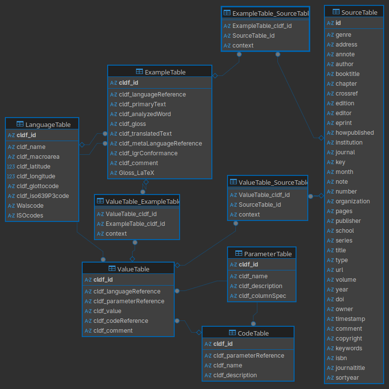

# Crosslinguistic database on nominal person

[](https://github.com/cldf-datasets/wals/actions?query=workflow%3ACLDF-validation)

This repository contains a database with syntactic data on >100 languages with a focus on properties relating to the phenomenon of (ad)nominal person. The code here creates a [CLDF](https://github.com/cldf/cldf/)-conformant database, a format designed for linguistic applications, from older (and somewhat unorderly) csv-files. The format also allows for the automatic generation of an SQLite database.

A previous implementation of the data as a relational (SQL) database can be found [here](https://github.com/gfkpth/nominal_person). That repo also contains the a jupyter notebook extracting example sentences for nominal person from a LaTeX-file, see  [here](https://github.com/gfkpth/nominal_person/tree/main/db-creation-notes/CLDF).

## How to cite


## Background: (Ad-)nominal person

One common form of nominal person are personal pronouns forming co-constituents of a co-referring nominal expression as in English *we linguists*.
More detailed information on relevant phenomena and the range of cross-linguistic variation can be found in [Höhn (2020)](https://doi.org/10.5334/gjgl.1121) and [Höhn (2024)](https://doi.org/10.1515/lingty-2023-0080) as well as [my dissertation](https://ling.auf.net/lingbuzz/003618). If you use this data, I'd appreciate it if you'd let me know. If you are a linguist interested in (ad)nominal person and struggle with using this database, feel free to get in touch.


## Dataset Properties

| Property | Value |
|----------|-------|
| dc:conformsTo | http://cldf.clld.org/v1.0/terms.rdf#StructureDataset |
| dc:identifier | https://github.com/gfkpth/nominalperson_cldf/ |
| dc:license | CC-BY |
| dc:source | sources.bib |
| dc:title | Adnominal person database |
| dcat:accessURL | https://github.com/gfkpth/nominalperson_cldf |
| prov:wasDerivedFrom | [{'rdf:about': 'https://github.com/gfkpth/nominalperson_cldf', 'rdf:type': 'prov:Entity', 'dc:created': 'ef41cd2', 'dc:title': 'Repository'}, {'rdf:about': 'https://github.com/glottolog/glottolog', 'rdf:type': 'prov:Entity', 'dc:created': 'v5.1-17-g06771a4e45', 'dc:title': 'Glottolog'}] |
| prov:wasGeneratedBy | [{'dc:title': 'python', 'dc:description': '3.13.5'}, {'dc:title': 'python-packages', 'dc:relation': 'requirements.txt'}] |
| rdf:ID | nominalperson_cldf |
| rdf:type | http://www.w3.org/ns/dcat#Distribution |

## Dataset Components

| File | Type | Rows |
|------|------|------|
| values.csv | ValueTable | 1800 |
| languages.csv | LanguageTable | 134 |
| examples.csv | ExampleTable | 158 |
| codes.csv | CodeTable | 62 |
| parameters.csv | ParameterTable | 17 |
| sources.bib | Sources | 178 |


## Files

- [cldf/](cldf/): contains the CLDF-version of the database
- [raw/](raw/): contains the raw files used to generate the CLDF database
  - when using the data in here to regenerate the database, make sure to run `cldfbench download nominalperson_cldf.py` first
- [etc/](etc/): not currently used
- [nominalperson.sqlite](nominalperson.sqlite): an SQLite-version of the database
- [cldfbench_nominalperson_cldf.py](cldfbench_nominalperson_cldf.py): controls the generation of the CLDF database from the data in `raw/`


## SQLite database

The file [nominalperson.sqlite](nominalperson.sqlite) contains an SQLite-version of the database. The database schema is visualised below:




# Feature description

For a description of most of the linguistically relevant properties used you can refer to

- the [parameter-codes.json](raw/parameter-codes.json)
- the list in [this previous project](https://github.com/gfkpth/nominal_person?tab=readme-ov-file#db-scheme).

To be extended


# Notes on the setup of a new CLDF

For the original tutorial see here: <https://github.com/cldf/cldfbench/blob/master/doc/tutorial.md>. The information in the README files of [`cldfbench`](https://github.com/cldf/cldfbench) and [`pycldf`](https://github.com/cldf/pycldf) is also going to be helpful.

In this section, I aim to document the concrete steps needed for my slightly more complex dataset.


## Preliminaries

0. Ensure that the python program `cldfbench` is installed, for instructions see [here](https://github.com/cldf/cldfbench/blob/master/README.md). Also install [`pycldf`](https://github.com/cldf/pycldf).

Using a virtual environment is recommended, I am using conda to create one inside the folder I want to use for the cldf.

```shell
conda create -p .venv python==3.12
conda activate .venv
pip install cldfbench pycldf
```

1. Create a new cldf structure. For consistency, make sure to provide as ID the name of the folder that you want to use.

```shell
cd ..
cldfbench new
```

I am moving one level up in the file structure because I created my virtual environment inside the target folder. If you're using a system-installed cldfbench (or create your virtual environment in a different location), you can just run `cldfbench new` in the parent folder of where you want your cldf folder to sit.

2. Insert any raw data that should be integrated into the dataset into the `raw/` Folder.

3. Run catconfig to install [glottolog](https://github.com/glottolog/glottolog) into the local system and create a catalog.ini file pointing to it. To make the API for glottolog available you also need to install the package `pyglottolog`, which I suggest installing before if it is not available in your system/virtual environment.

```shell
pip install pyglottolog
cldfbench catconfig
```

This prompts you to install several auxiliary datasets. For the current use case, I want glottolog, so I pick yes to that and decline the concepticon and clts.
Note that on Linux this clones <https://github.com/glottolog/glottolog> into ~/.config/cldf/glottolog, with a weight of about 1.5GB.

Alternatively, you could download/`git clone https://github.com/glottolog/glottolog` into some other location and create a ~/.config/cldf/catalog.ini file with the appropriate path as follows (I'm not sure if this has any downsides to directly following the catconfig flow in use cases I haven't encountered yet):

```shell
# ~/.config/cldf/catalog.ini
[clones]
glottolog = /path/of/your/local/glottolog/repository
```


## Setting up the cldfbench_[projectname].py

As described in the available tutorials, `cldfbench new` creates a general template on which to build. The crucial code for converting my csv-data into CLDF needs to go to `cldfbench-[projectname].py`. 

The following code generates the CLDF-conformant dataset in the `cldf/` folder:

```shell
cldfbench makecldf cldfbench_nominalperson_cldf.py
```

The following code validates the generated dataset and displays errors or warnings encountered during validation:

```shell
cldf validate cldf/
```

## Generating an SQLite database

The following code generates an SQLite database from the CLDF

```shell
cldf createdb cldf nominalperson.sqlite
```

# Versions

## v1.0 (2025-07-30)

- first usable version


# To Do:

## Content

- automatic association of examples to specific parameter values is rather coarse at the moment, consider manual mapping

## Documentation

- adding more detail to README
- write-up for usage, especially regarding parameter-codes.json
- details for tutorial-like guide
  - What are possible values for `args.writer.objects['ValueTable']`?
  - How does the following part skipped over in the tutorial work when needed?
    - "Because we only create a single CLDF dataset here, we do not need to call with self.cldf_writer(...) as ds: explicitly. Instead, an initialized cldfbench.cldf.CLDFWriter instance is available as args.writer."
  - sources and examples need to be supplied to CLDF as list (not as string, even though the output CSV files list them as strings)
  - add note to fix reference to actual metadata file in .github/workflows/cldf-validation.yml (last line is hard-coded to `cldf/cldf-metadata.json`, adapt this to the name of your metadata file in order to get automatic testing to work correctly)


# Acknowledgements

I am very grateful to Robert Forkel for help with fixing issues and getting a better understanding of the way CLDF works. 

Parts of the data reported here were collected while working in a project funded through the European Research Council Advanced Grant No. 269752 “Rethinking Comparative Syntax” (PI Ian Roberts).

# License

Shield: [![CC BY 4.0][cc-by-shield]][cc-by]

This work is licensed under a
[Creative Commons Attribution 4.0 International License][cc-by].

[![CC BY 4.0][cc-by-image]][cc-by]

[cc-by]: http://creativecommons.org/licenses/by/4.0/
[cc-by-image]: https://i.creativecommons.org/l/by/4.0/88x31.png
[cc-by-shield]: https://img.shields.io/badge/License-CC%20BY%204.0-lightgrey.svg
